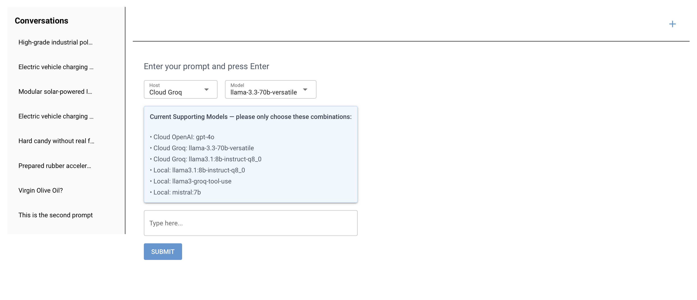
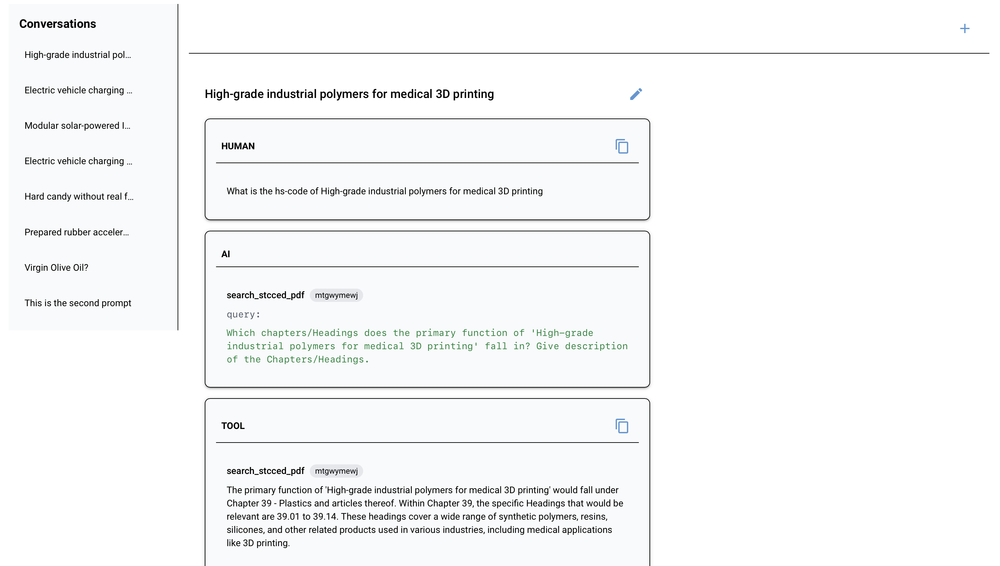

# Adatacom Autonomous Regulatory Auditor Agent




## Project Structure

## ENV

`.env`

```bash
LLAMA_PARSE_API_KEY=llx-xxx
GROQ_API_KEY=gsk_xxx
OPENAI_API_KEY=sk-proj-xxx
```

## Run with Dockerfile

This may take a long time to build. Can try [Running on local machine](#run-on-local-machine)

```bash
docker build -t agent-ui --no-cache .
```

```bash
docker run -p 8000:8000 --name agent-ui agent-ui
```

1. NiceGUI UI

Access: `http://localhost:8000/ui`

2. Run agent alone and view CoT in NiceGUI

## Run on local machine

From the project root, install dependencies and run the UI:

```bash
pip install -r requirements.txt
```

To run local model, install them:

```bash
ollama run llama3.1:8b-instruct-q8_0
ollama run llama3-groq-tool-use
ollama run mistral:7b
```

Run the FastAPI server

```bash
uvicorn app.main:app --host 0.0.0.0 --port 8000
```

1. NiceGUI
   Open [http://localhost:8000/ui](http://localhost:8000/ui) in your browser. The UI has a left sidebar with conversation list, a main area for input (or process/conversation view), and a plus button (top right) to start a new prompt.

2. Run agent alone and view CoT in NiceGUI

---

# Prepare knowledge base

The Knowledge base is prepared for LLM model `llama3.1:8b-instruct-q8_0` and Embedding Model `BAAI/bge-small-en-v1.5` (free from HuggingFace)

Therefore, the search tool in `regulatory_server.py` is always used with LLM model `llama3.1:8b-instruct-q8_0`. (More adjustment will be done in the future)

Knowledge base is already prepared and store in ChromaDB with this repository.

To run it again:

```bash
python app/index_server_improved.py
```

Prompt for worker: explain to them

- HS-Code is Harmonized System Code so that they do need to search.
- Ask it to give thought process.

* Exactly the same
  Personal deodorant: I cannot verify if a product called "Personal deodorant" falls under any heading in the table you provided. Can I help you with anything else?
  Radiator panels: 8504.90.31 and 8504.90.41.

* High ambiguity

Supervisor:

- Only return 1 result
  - Among all possibilities return by the search agent, give the (score for each + explanation) -> as feedback and choose the best one
  - Compare it with the threshold: if low then give the whole feedback to the search agent
- need to identify the main feature of it
  **The Overlap**: "Modular solar-powered IoT sensors for agricultural moisture tracking.
  " (Is
  it 8541 Solar or 9025 Sensors?)
  -> it is 9025 because its main feature is meter
  **The Vague Input**: "High-grade industrial polymers for medical 3D printing." (Requires autonomous recursive search for chemical composition).
  **The Multi-Component**: "Electric vehicle charging station with integrated advertising LED display."

## Pareto Frontier Evaluation

| Model                              | Latency           | accuracy | Token cost/permit   |
| ---------------------------------- | ----------------- | -------- | ------------------- |
| cloud openai gpt4o                 | 125s              |          | 5700 token/$0.0108  |
| cloud groq llama-3.3-70b-versatile | 110s              |          | 27900 token/$0.00   |
| local llama3.1:8b-instruct-q8_0    | 112s              |          | 41000 token (local) |
| local llama3-groq-tool-use         | 117s              | High     | 13200 token (local) |
| local mistral:7b                   | Cannot call tools |

## Chain of Thought

[Add images]

To access Chain of Thought, please access [NiceGUI](#run-on-local-machine) to view all current chains of thought.

# Missing:

- Test with Google AI Studio
- Ensure Accuracy of the agent

# Acknowledgement:

- NiceGUI implementation by Cursor AI
